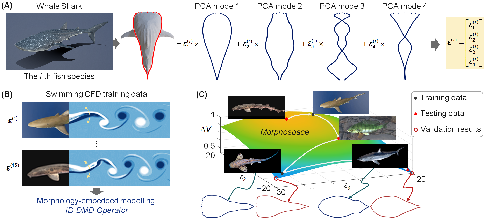
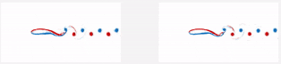
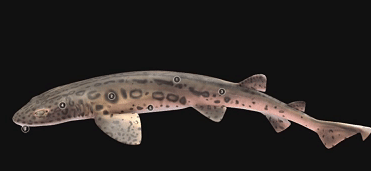
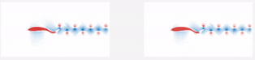
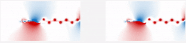
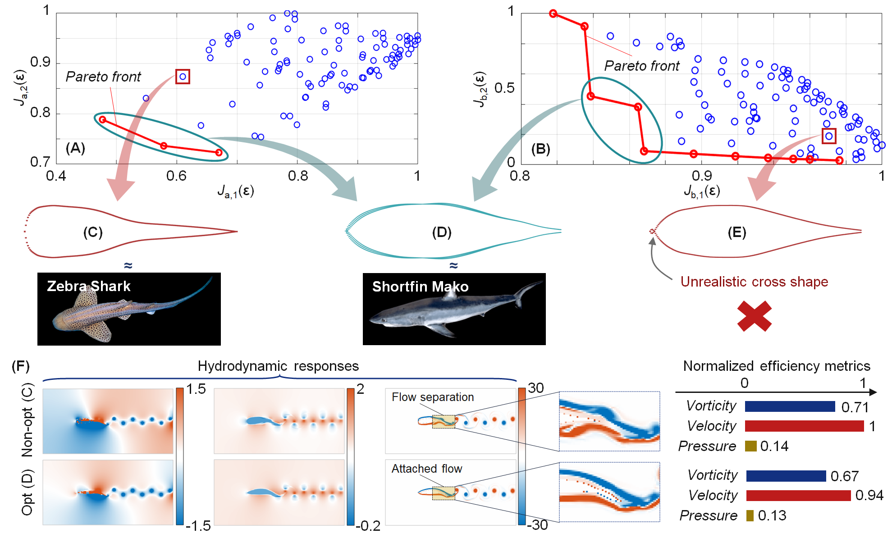

# ID-DMD-for-Fish-Body-Design

 

## 1. Code Workflow

All fish hydrodynamic data are summarised in the folder **`Fishes dataset`**.  
The dataset includes 15 fish species, together with their body shapes and corresponding hydrodynamic fields, including:

- Pressure fields
- Velocity fields
- Vorticity fields

Please run the code in the following order:

### A0s: Fish Body Shape Analysis

This part analyses the 2D fish body shapes and extracts shape features for subsequent modelling and design.

### A1s: Fluid Field Dynamics Analysis

This part analyses the fluid-field dynamics of the fish swimming simulations, including pressure, velocity, and vorticity fields.

### B: ID-DMD Identification

This part identifies the inverse-design Dynamic Mode Decomposition model based on the extracted fish-shape and hydrodynamic-field data.

### C: Data Preparation for Optimisation

This part prepares the ID-DMD-based reduced-order data required for optimisation and design.

### D: Optimisation and Design

This part performs optimisation and design based on the trained ID-DMD model.

## 2. Results

With MATLAB codes for the Fish Body Design paper: https://www.biorxiv.org/content/10.64898/2026.05.06.723159v1

Example demonstrations (*Left*: **ID-DMD**; *Right*: **Ground true**)

**i.e. Leopard Cat Shark (Never seen in training data):**

<table width="90%">
  <tr>
    <th width=30%">Fish</th>
    <th width="60%">Hydrodynamics</th>
  </tr>
  <tr>
    <td>&emsp;</td>
    <td>Vorticity: </td>
  </tr>
  <tr>
    <td></td>
    <td>Velocity: </td>
  </tr>
  <tr>
    <td>&emsp;</td>
    <td>Pressure: </td>
  </tr>
</table>

 

